# AWS Auto Scaling with Docker 3‑Tier Setup & SNS Notification

This project demonstrates how to set up **AWS Auto Scaling** using:

-   Launch Template\
-   User‑data shell script\
-   Docker 3‑tier (NGINX + PHP + MySQL)\
-   Auto Scaling Group\
-   AWS SNS Email Notification

------------------------------------------------------------------------

## 📌 1. Prerequisites

Before starting, ensure you have:

-   AWS account\
-   IAM user with EC2, Auto Scaling, SNS permissions\
-   Key pair created\
-   VPC, Subnets, and Security Groups\
-   Email verified in SNS

------------------------------------------------------------------------

## 📌 2. Create SNS Topic (Email Notifications)

### ✔ Step 1: Create SNS Topic

1.  AWS → SNS → **Topics**\
2.  Click **Create topic**\
3.  Type: **Standard**\
4.  Name: `AutoScaling-Alerts`\
5.  Create

### ✔ Step 2: Create Email Subscription

1.  SNS → Topic → `AutoScaling-Alerts`\
2.  Click **Create subscription**\
3.  Protocol: **Email**\
4.  Enter email\
5.  Confirm subscription email

------------------------------------------------------------------------

## 📌 3. Create Security Group for EC2

Name: `asg-sg`

  Port   Purpose
  ------ -----------------------
  22     SSH
  80     NGINX Webserver
  3306   MySQL (Internal Only)

------------------------------------------------------------------------

## 📌 4. User‑Data Shell Script (autoscaling.sh)

``` bash
#!/bin/bash

sudo apt update -y
sudo apt install docker.io -y
sudo systemctl start docker
sudo systemctl enable docker

docker network create frontend
docker network create backend

docker run -d --name mysql-db --network backend -e MYSQL_ROOT_PASSWORD=admin123 -e MYSQL_DATABASE=projectdb mysql:5.7

docker run -d --name php-app --network backend --network frontend -v /var/www/html:/var/www/html php:8.2-fpm

docker run -d --name nginx-web --network frontend -p 80:80 -v /var/www/html:/var/www/html -v /etc/nginx/conf.d:/etc/nginx/conf.d nginx

echo "Setup completed." > /home/ubuntu/status.txt
```

------------------------------------------------------------------------

## 📌 5. Create Launch Template

1.  AWS → EC2 → Launch Templates → **Create**
2.  Name: `docker-autoscaling-template`
3.  
4.  AMI: Ubuntu 22.04\
5.  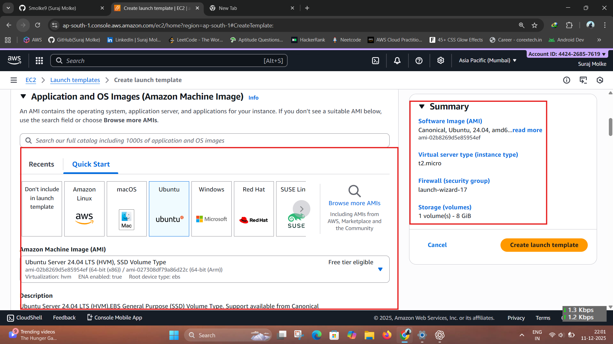
6.  Instance Type: t2.micro\
7.  Key pair\
8.  Security Group: `asg-sg`\
9.  Advanced Details → **User Data** → paste `autoscaling.sh`\
10.  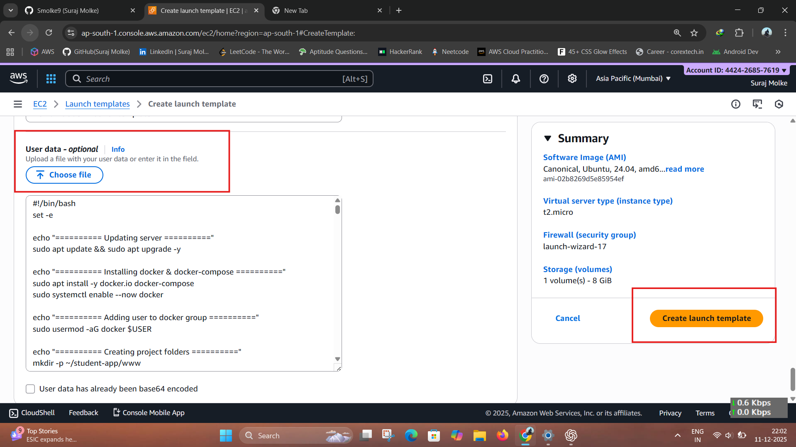
11.  Create
12.  

------------------------------------------------------------------------

## 📌 6. Create Auto Scaling Group

1.  AWS → Auto Scaling → **Create ASG**\
2.  Name: `docker-app-asg`\
3.  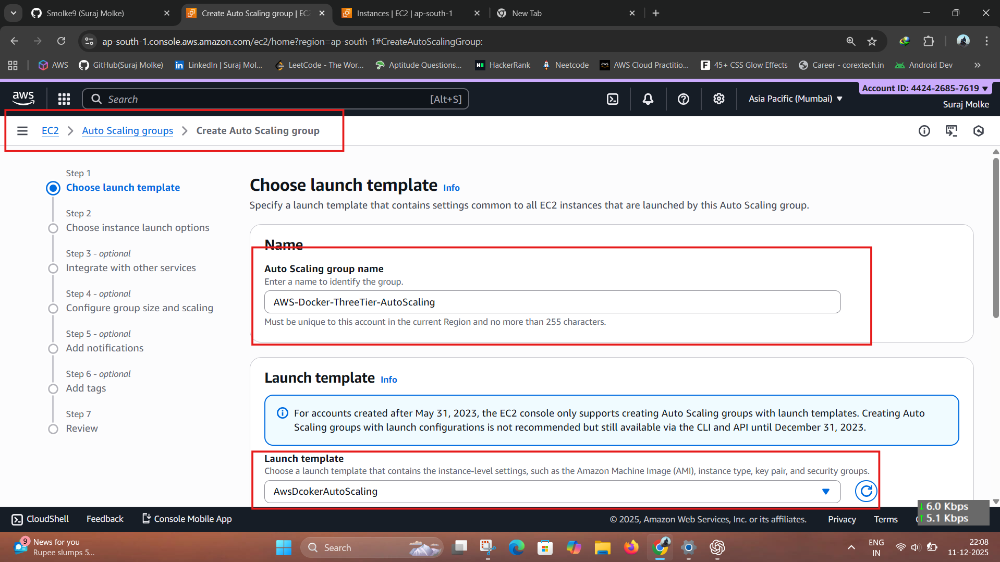
4.  Select Launch Template\
5.  Select VPC + 2 subnets
6.  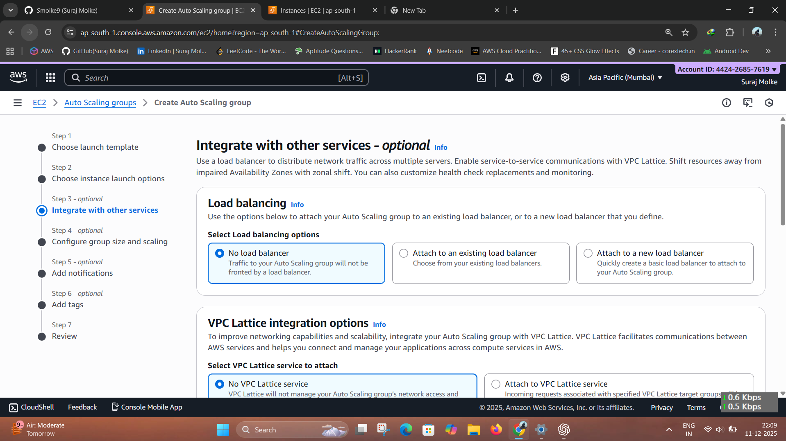

### Configure Capacity:

-   Desired: **1**\
-   Minimum: **1**\
-   Maximum: **3**
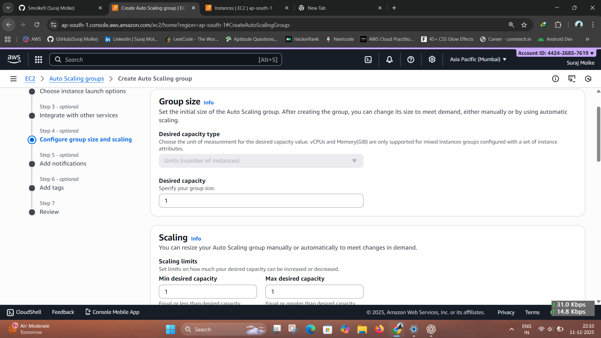
### Scaling Policy:

-   Type: **Target Tracking**
-   Metric: *Average CPU Utilization*
-   Target: **60%**

### Add SNS Notification:

-   Topic: `AutoScaling-Alerts`\
-   Events:\
    ✔ Instance Launch\
    ✔ Instance Terminate
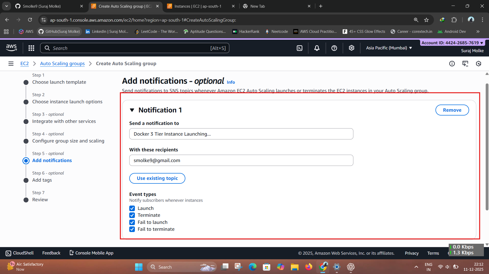
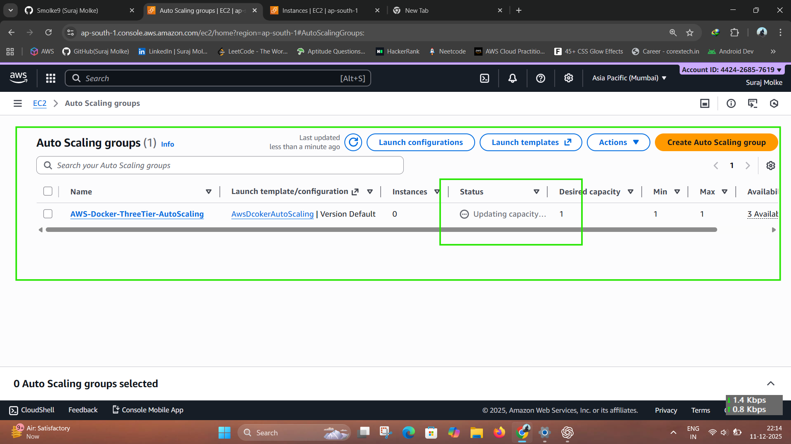
------------------------------------------------------------------------

## 📌 7. Test Auto Scaling

### View instance:
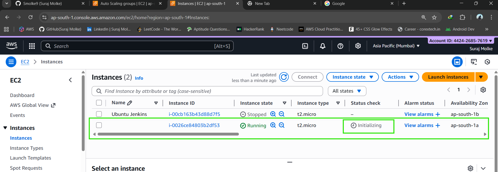
AWS → EC2 → **Instances**

### Open Public IP:
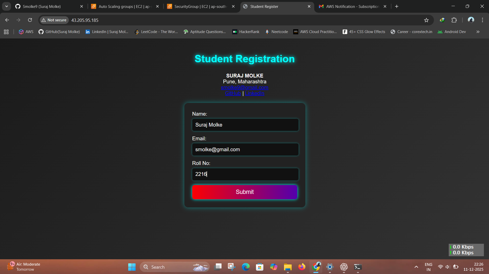
NGINX + PHP page should appear.
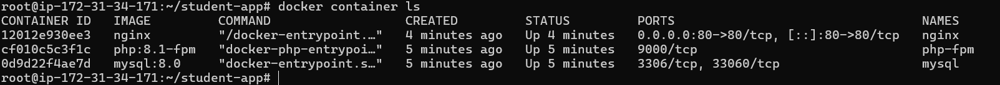
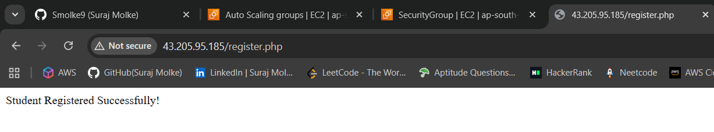
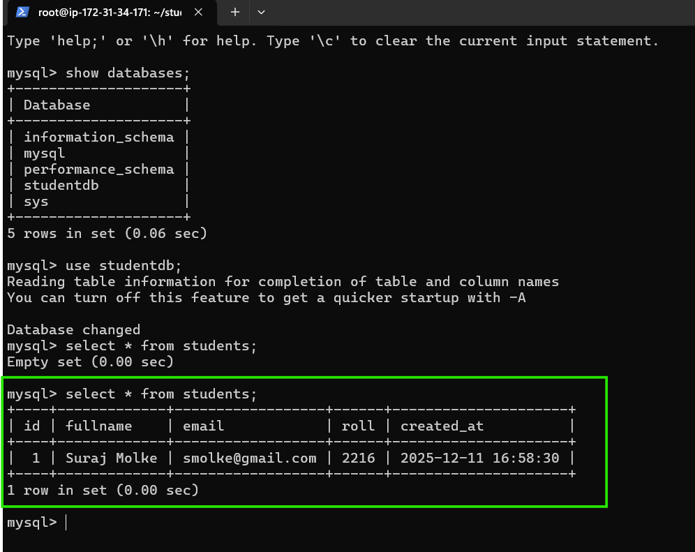
## 📌 SNS Email Notifications
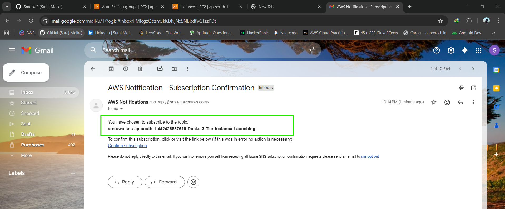
### Stress CPU to trigger scaling:

``` bash
sudo apt install stress -y
stress --cpu 2 --timeout 300
```

EC2 will scale up/down and SNS will send: - "EC2 Instance Launch
Successful" - "EC2 Instance Termination Successful"

------------------------------------------------------------------------

## 📌 Project Structure

    /aws-autoscaling-docker
     ├── autoscaling.sh
     ├── README.md

------------------------------------------------------------------------

## 📌 Author

**Suraj Molke**\
AWS \| DevOps \| Cloud Projects
